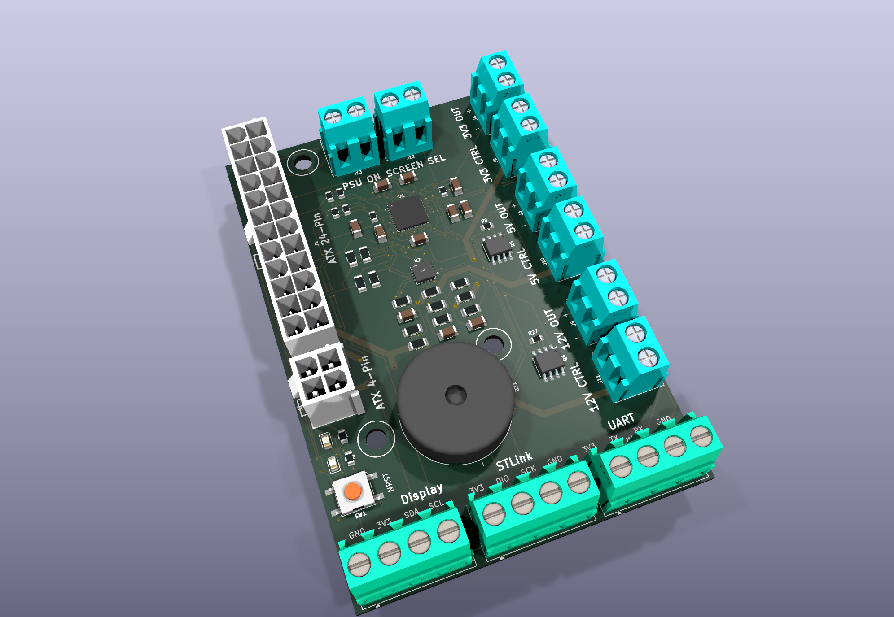
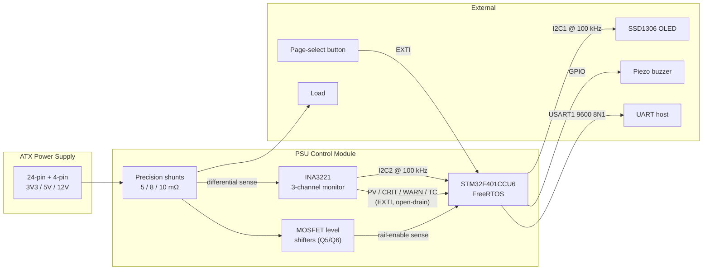
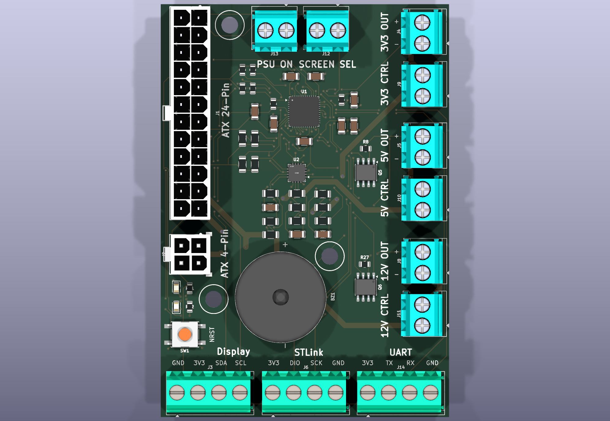
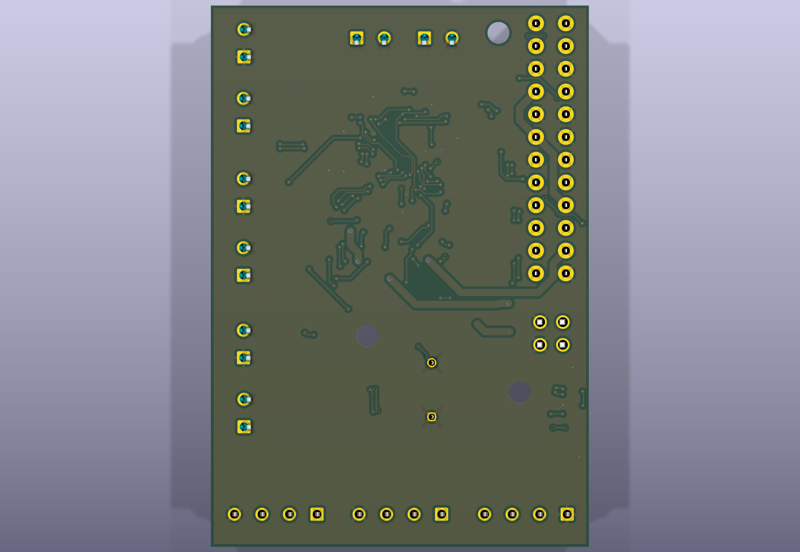
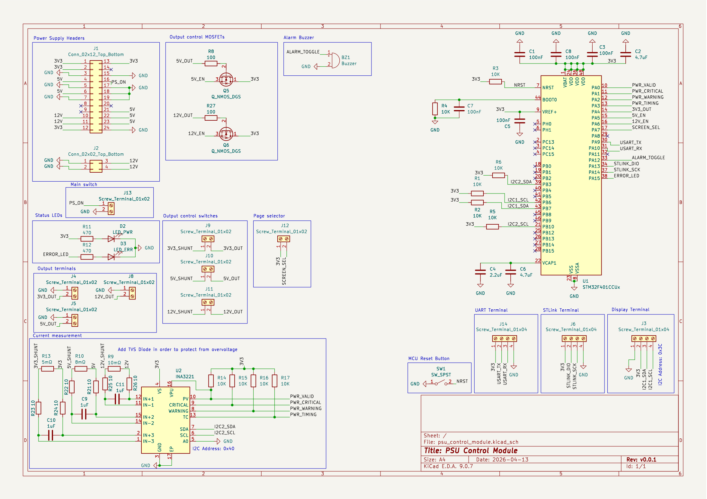
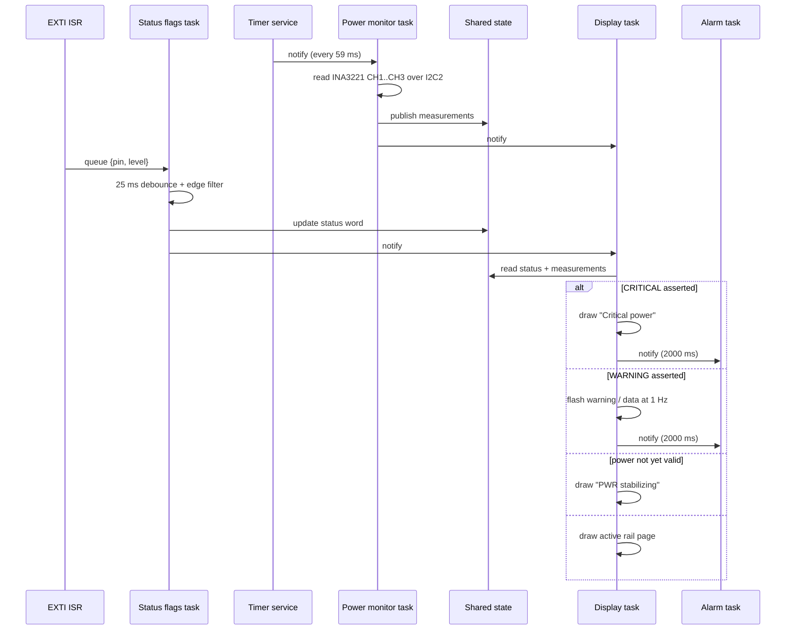

# PSU Control Module

**A FreeRTOS-based monitoring and control board for ATX power supplies — custom PCB, custom firmware, custom drivers.**

An ATX PSU is a cheap, capable bench supply, but it exposes no telemetry: you cannot see what a rail is delivering, and nothing warns you before a rail is overloaded. This project turns one into an instrumented bench supply. A custom 2-layer board taps the 3.3 V, 5 V and 12 V rails through precision shunts, an INA3221 measures each rail continuously, and an STM32F401 running FreeRTOS renders live power/current on an OLED, raises a buzzer alarm on the INA3221's hardware over-current alerts, and streams structured logs over UART.

Both halves are mine: the schematic and board layout in KiCad, and the firmware — written directly against the STM32 HAL and FreeRTOS with no CubeMX code generation, plus three reusable driver libraries published as separate repositories.

<p align="center">
  
</p>

---

## Table of contents

- [Feature overview](#feature-overview)
- [System architecture](#system-architecture)
- [Hardware](#hardware)
  - [Board renders](#board-renders)
  - [Schematic](#schematic)
  - [Connector map](#connector-map)
  - [Rail sensing chain](#rail-sensing-chain)
  - [Pin assignment](#pin-assignment)
- [Firmware](#firmware)
  - [Task model](#task-model)
  - [Event flow](#event-flow)
  - [Driver stack](#driver-stack)
- [Engineering notes](#engineering-notes)
- [Repository layout](#repository-layout)
- [Building and flashing](#building-and-flashing)
- [Project status](#project-status)
- [Author](#author)

---

## Feature overview

| | |
|---|---|
| **Three-rail telemetry** | Simultaneous bus-voltage and shunt-current measurement on the 3.3 V, 5 V and 12 V rails via a single INA3221 |
| **Hardware alarm path** | The INA3221's `CRITICAL`, `WARNING`, `PV` and `TC` open-drain outputs drive four MCU interrupt lines — over-current detection does not depend on firmware polling |
| **Audible + visual alerts** | Piezo buzzer on a dedicated task, error LED, and a flashing on-screen warning that alternates with live data |
| **OLED user interface** | 128×64 SSD1306 over I²C, one page per rail, cycled by an external push-button |
| **Per-rail enable sensing** | MOSFET level-shifters report which rails are actually switched on, so disabled channels are shown as such and their INA3221 channels are powered down |
| **Structured UART logging** | Levelled logging (`INFO`/`ERROR`/`FATAL`) with a fail-safe fallback mode that blinks the error LED if UART itself cannot be brought up |
| **Fully custom board** | 69.75 × 100 mm 2-layer PCB, 55 placements, ATX 24-pin + 4-pin inlets, screw-terminal breakouts for every rail |

---

## System architecture



The design deliberately splits responsibility between silicon and software. Threshold detection lives in the INA3221 — critical and warning limits are programmed once into its registers and asserted on dedicated pins — while the MCU is responsible for presentation, aggregation and the alarm policy. A firmware stall therefore cannot silently mask an over-current condition.

---

## Hardware

Designed in **KiCad 9**. The board sits between the PSU and the load: ATX connectors in on the left edge, screw terminals for every rail and every peripheral around the remaining three edges.

| Property | Value |
|---|---|
| Dimensions | 69.75 × 100 mm |
| Layers | 2 (F.Cu / B.Cu), 1.6 mm |
| Placements | 55 components, 63 nets |
| MCU | STM32F401CCU6, QFN-48 7×7 mm |
| Monitor | TI INA3221, VQFN-16 4×4 mm |
| Inlets | ATX 24-pin (J1) + ATX 4-pin (J2), Molex |
| Breakouts | 11 screw terminals (rail outputs, rail switches, display, SWD, UART) |
| Revision | v0.0.1 |

### Board renders

| Top | Bottom |
|---|---|
|  |  |

### Schematic

[](docs/schematic.pdf)

Full resolution: **[PDF](docs/schematic.pdf)** · **[SVG](docs/images/schematic.svg)** · Bill of materials: **[CSV](docs/bom.csv)**

### Connector map

| Ref | Label | Function |
|---|---|---|
| J1 | `ATX 24-Pin` | Main PSU inlet — supplies 3V3, 5V, 12V and `PS_ON#` |
| J2 | `ATX 4-Pin` | Auxiliary 12 V inlet |
| J13 | `PSU ON` | External latching switch; shorts `PS_ON#` to GND to start the PSU |
| J12 | `SCREEN SEL` | External momentary button; cycles the OLED page |
| J9 / J10 / J11 | `3V3 / 5V / 12V CTRL` | External switch per rail, in series between the shunt and the output terminal |
| J4 / J5 / J8 | `3V3 / 5V / 12V OUT` | Switched rail output to the load |
| J3 | `Display` | SSD1306 — 3V3, GND, SDA, SCL (I²C address `0x3C`) |
| J6 | `STLink` | SWD programming/debug header — 3V3, DIO, SCK, GND |
| J14 | `UART` | Log output — 3V3, TX, RX, GND |
| SW1 | `NRST` | MCU reset |
| BZ1 | — | Piezo alarm buzzer |
| D2 / D3 | `LED_PWR` / `LED_ERR` | Power-good and error indicators |

Each rail is broken out as a **CTRL** pair and an **OUT** pair. The user's switch (or contactor) goes across CTRL; the load goes on OUT. This keeps the board free of high-side switching while still letting the firmware know whether a rail is live.

### Rail sensing chain

Each rail passes through a low-value shunt sized for that rail's expected current, and the differential voltage is fed to one INA3221 channel through a 10 Ω / 1 µF RC filter:

| INA3221 channel | Rail | Shunt | Warning threshold | Critical threshold |
|---|---|---|---|---|
| CH1 | 12 V | R9 — 10 mΩ | 10 A | 14 A |
| CH2 | 5 V | R10 — 8 mΩ | 14 A | 18 A |
| CH3 | 3.3 V | R13 — 5 mΩ | 23 A | 27 A |

Thresholds are written to the INA3221 as shunt voltages (for example 140 mV = 14 A across 10 mΩ) so the comparison happens in hardware.

Rail-enable sensing uses **Q5** and **Q6** as source followers rather than switches: the drain sits at 3V3, the gate is driven by the 5 V or 12 V output rail, and the source feeds the MCU GPIO. When the rail is live the follower pulls the pin up to ~3.3 V; when it is dead the pin is held down by the MCU's internal pull-down. This gives a 5 V/12 V-tolerant presence detector for two components per rail. The 3.3 V rail needs no shifter and drives its GPIO directly.

### Pin assignment

| Pin | Net | Direction | Purpose |
|---|---|---|---|
| PA0 | `PWR_VALID` | EXTI, pull-up | INA3221 `PV` — bus voltages within limits (active high) |
| PA1 | `PWR_CRITICAL` | EXTI, pull-up | INA3221 `CRITICAL` (active low) |
| PA2 | `PWR_WARNING` | EXTI, pull-up | INA3221 `WARNING` (active low) |
| PA3 | `PWR_TIMING` | EXTI, pull-up | INA3221 `TC` timing-control alert (active low) |
| PA4 | `3V3_OUT` | EXTI, pull-down | 3.3 V rail enabled |
| PA5 | `5V_EN` | EXTI, pull-down | 5 V rail enabled (via Q5) |
| PA6 | `12V_EN` | EXTI, pull-down | 12 V rail enabled (via Q6) |
| PA7 | `SCREEN_SEL` | EXTI rising | Page-select button |
| PA9 | `USART_TX` | AF7 | Log output |
| PA10 | `USART_RX` | AF7 | Reserved |
| PA12 | `ALARM_TOGGLE` | Output PP | Buzzer |
| PA13 / PA14 | `STLINK_DIO` / `SCK` | AF | SWD |
| PA15 | `ERROR_LED` | Output PP | Error indicator |
| PB6 / PB7 | `I2C1_SCL` / `SDA` | AF4, OD | SSD1306 display |
| PB10 / PB3 | `I2C2_SCL` / `SDA` | AF4 / AF9, OD | INA3221 |

Two separate I²C buses are used so a hung display cannot block power telemetry, and vice versa.

---

## Firmware

C11, built with `arm-none-eabi-gcc` against **STM32 HAL** and **FreeRTOS v10**, hard-float (`-mfpu=fpv4-sp-d16 -mfloat-abi=hard`). No CubeMX-generated code — peripheral init, MSP layer and interrupt vectors are written by hand under `Src/` and `Src/msp/`.

### Task model

| Task | Priority | Stack | Wakes on | Responsibility |
|---|---|---|---|---|
| Power monitor | 5 | 1024 w | Software-timer notification (59 ms) | Reads all three INA3221 channels, publishes results, notifies the display |
| Status flags | 4 | 1024 w | Queue from EXTI ISR | Debounces GPIO events and folds them into a packed 32-bit status word |
| Alarm buzzer | 4 | 1024 w | Task notification with duration | Drives the buzzer for a requested interval, then self-clears |
| Display | 3 | 1024 w | Task notification | Renders the active page, warning or error screen |
| Timer service | 2 | — | FreeRTOS timers | Power-monitor polling tick, warning-flash cycle |

Ordering is deliberate: acquisition outranks input handling, which outranks rendering, so the display is the first thing to be starved under load rather than the measurement path.

Inter-task state uses two shared values guarded by the [`stm32_shared_values`](https://github.com/ikok07/stm32_shared_values) library — a mutex-protected 32-bit **status word** and a mutex-protected **measurement buffer** — with all accesses on bounded timeouts. Tasks never touch each other's locals.

The status word packs the whole UI state into 32 bits:

```
bit  0  PWR_VALID        bit  4  3V3_EN         bits 7-8  display page (0..2)
bit  1  PWR_CRITICAL     bit  5  5V_EN          bit  9    ERR_ACTIVE
bit  2  PWR_WARNING      bit  6  12V_EN
bit  3  PWR_TIMING
```

### Event flow



Interrupt handlers do no work beyond capturing the pin and its level into a queue — debouncing, mutex acquisition and logging all happen in task context, so no ISR ever blocks on a lock.

### Driver stack

Three of the libraries in `lib/` are my own, developed for this project and published standalone so they can be reused:

| Library | Repository | Role |
|---|---|---|
| `INA3221` | [ikok07/ina3221-generic-driver](https://github.com/ikok07/ina3221-generic-driver) | Platform-agnostic INA3221 driver. Injects `I2CSend` / `I2CRead` / `LogError` callbacks, so it carries no vendor HAL dependency |
| `shared_values` | [ikok07/stm32_shared_values](https://github.com/ikok07/stm32_shared_values) | Mutex-guarded scalar and pointer containers with timeout-bounded get/set |
| `logger` | [ikok07/stm32_logger](https://github.com/ikok07/stm32_logger) | Levelled logging with pluggable transport callbacks and a degraded "basic" mode |

Third-party: [afiskon/stm32-ssd1306](https://github.com/afiskon/stm32-ssd1306) for the OLED, ST's HAL/CMSIS, and FreeRTOS.

---

## Engineering notes

A few decisions that are not obvious from the code:

**The HAL tick runs on TIM9, not SysTick.** FreeRTOS owns SysTick on Cortex-M, but the STM32 HAL also wants it for `HAL_Delay` and its timeout logic. `HAL_InitTick()` is overridden in `Src/msp/tim_msp.c` to configure TIM9 as a 1 MHz / 1 ms base with its own IRQ, which keeps HAL timeouts working while the scheduler is running and avoids the classic "HAL blocks forever inside a task" failure.

**The polling period is derived from the sensor, not guessed.** At 64-sample averaging with 140 µs bus and shunt conversion times across 3 channels, one full INA3221 conversion round takes 53.76 ms. The software timer is set to 59 ms — the conversion time plus ~5 ms of margin — so the MCU reads each sample exactly once instead of re-reading stale registers or missing conversions.

**Debouncing is a task-side concern.** The EXTI handler pushes `{pin, level}` into a queue and returns. The status-flags task keeps per-pin timestamps and last-known levels, and discards anything within 25 ms of the previous accepted edge or that does not represent an actual change. Contact bounce on eight mechanical inputs therefore costs queue slots, not interrupt latency.

**Alert polarity is handled per-signal.** The INA3221's alert pins are open-drain and active low, while `PV` is released high when power is valid. `handle_status_change()` encodes this asymmetry explicitly rather than assuming a uniform convention across the four lines.

**Logging degrades instead of failing.** `LOGGING_Init()` registers both a full UART transport and a "basic" fallback. If UART initialisation fails, the logger falls back to driving the error LED, so a board with a broken serial path still signals fatal faults.

**Channels follow the UI.** The display task enables only the INA3221 channels whose rails are actually switched on, so measuring a disconnected rail neither wastes conversion time nor produces a misleading reading.

---

## Repository layout

```
├── Src/                     Application: tasks, drivers glue, IRQ handlers
│   ├── main.c               Init sequence + scheduler start
│   ├── pwr_monitor.c        INA3221 setup, I2C transport, acquisition task
│   ├── status_flags.c       EXTI capture, debounce, packed status word
│   ├── display.c            SSD1306 rendering and page logic
│   ├── alarm.c              Buzzer task
│   ├── logging.c            UART logger + fallback transport
│   ├── stm32f4xx_it.c       Interrupt vectors
│   └── msp/                 Peripheral MSP init (I2C, TIM, UART)
├── Include/                 Pin maps, NVIC priorities, task config, bit defs
├── lib/
│   ├── INA3221/             ← own submodule
│   ├── shared_values/       ← own submodule
│   ├── logger/              ← own submodule
│   ├── ssd1306/             third-party display driver
│   ├── FreeRTOS/            kernel + FreeRTOSConfig.h
│   ├── FreeRTOS_Port/       ARM_CM4F port
│   ├── HAL/ CMSIS/          ST HAL and CMSIS
│   └── CubeF4/              vendor reference tree
├── psu_control_module_pcb/  ← KiCad project submodule (schematic, PCB, STEP, BOM)
├── docs/                    Datasheets, exported schematic, renders, BOM
├── CMakeLists.txt           Build definition
├── gcc-arm-none-eabi.cmake  Toolchain file
├── STM32F401XX_FLASH.ld     Linker script
└── openocd.cfg              ST-Link/OpenOCD configuration
```

Board configuration is centralised: every pin lives in `Include/gpio_defs.h`, every task priority and stack size in `Include/tasks_common.h`, and every NVIC priority in `Include/nvic_prio_defs.h`. Retargeting the firmware to a revised board is a header change, not a search-and-replace across `Src/`.

---

## Building and flashing

**Requirements** — CMake ≥ 3.22, Ninja, `arm-none-eabi-gcc`, OpenOCD, an ST-Link, and KiCad 9 if you want to open the hardware.

```bash
git clone --recurse-submodules https://github.com/ikok07/stm32_psu_control_module.git
cd stm32_psu_control_module

cmake --preset Debug          # or: --preset Release
cmake --build --preset Debug
```

The build prints a memory-usage summary; the ELF lands in `build/Debug/`.

Flash over SWD (J6):

```bash
openocd -f openocd.cfg -c "program build/Debug/stm32_f401_cbu6.elf verify reset exit"
```

Watch the logs on the UART terminal (J14) at **9600 8N1**.

Regenerating the hardware documentation in `docs/` from the KiCad sources:

```bash
kicad-cli sch export pdf    -o docs/schematic.pdf  psu_control_module_pcb/psu_control_module.kicad_sch
kicad-cli sch export bom    -o docs/bom.csv --group-by Value psu_control_module_pcb/psu_control_module.kicad_sch
kicad-cli pcb render        -o docs/images/pcb_3d_top.png --quality high --perspective \
                               --rotate=335,0,20 --zoom 0.8 --floor --background opaque \
                               psu_control_module_pcb/psu_control_module.kicad_pcb
```

---

## Project status

Hardware revision **v0.0.1** is complete and manufacturable; firmware is at end-to-end bring-up. The RTOS scaffolding, status-flag pipeline, display stack, alarm path and logging are implemented and exercised; INA3221 acquisition is wired end to end but its `INA3221_Init()` call and polling timer are currently commented out in `Src/pwr_monitor.c` pending hardware bring-up of the sensor, so the display currently runs from the status-flag path alone.

Known work remaining:

- Bring up the INA3221 on real hardware and re-enable acquisition.
- Add the TVS diode noted on the schematic for rail over-voltage protection.
- Re-check the display page ↔ INA3221 channel ordering: hardware wires CH1 to the 12 V shunt and CH3 to the 3.3 V shunt, while the display pages are ordered 3V3 → 5 V → 12 V and index the result array directly.
- Size `configTOTAL_HEAP_SIZE` against the four 1024-word task stacks.
- Explicit system-clock configuration; the MCU currently runs from the default 16 MHz HSI.

---

## Author

**Kaloyan Stefanov** — hardware and firmware.

Schematic capture and PCB layout in KiCad; bare-metal STM32 firmware on FreeRTOS; three reusable embedded libraries published alongside.
